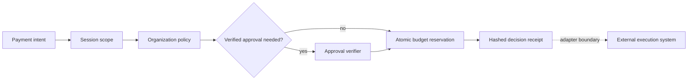

<div align="center">

# KeyVeil

**Fail-closed policy decisions for AI-agent payment intents.**

[](https://github.com/LASZLO-Quantification/KeyVeil/actions/workflows/ci.yml)
[](https://www.python.org/)
[](./LICENSE)

`REFERENCE IMPLEMENTATION` | `SYNTHETIC INTENTS` | `NO SIGNER` | `NO FUNDS`

</div>

KeyVeil is a small Python reference for placing explicit policy and budget
boundaries between an AI agent's payment intent and an execution adapter. It
does not hold keys, sign transactions, broadcast payments, or connect to a
broker or blockchain.

## Decision loop



The implemented loop stops at the hashed decision receipt. Execution belongs
to a separate, explicitly trusted adapter.

## What is implemented

- Finite, positive amount validation at the model boundary.
- Fail-closed session recipient and token allowlists.
- Immutable organization policy with optional global constraints.
- Intent-bound, expiring HMAC approval grants for the local reference flow.
- Thread-safe daily and weekly budget reservations with full-intent idempotency.
- Versioned decision receipts with a canonical intent hash and policy, session,
  approval, and reservation context.
- Canonical SHA-256 receipt hashes for tamper detection.
- Synthetic FastAPI scenarios and a responsive decision-workbench demo.

## Quick start

```bash
python -m venv .venv
# Windows: .venv\Scripts\activate
# macOS/Linux: source .venv/bin/activate
pip install -e ".[dev]"
pytest -q
keyveil-dashboard
```

Open `http://127.0.0.1:8765`.

Docker:

```bash
docker build -t keyveil-reference .
docker run --rm -p 8765:8765 keyveil-reference
```

## Library example

```python
import time

from agent_wallet import (
    InMemoryBudgetStore,
    PaymentIntent,
    PolicyEngine,
    SessionScope,
    evaluate_payment,
)

now = int(time.time())
recipient = "0x1111111111111111111111111111111111111111"

scope = SessionScope(
    session_id="task-session-01",
    agent_id="agent-01",
    expires_at_epoch=now + 3600,
    max_per_tx_usd=5.0,
    daily_budget_usd=20.0,
    allowed_recipients=frozenset({recipient}),
    allowed_tokens=frozenset({"USDC"}),
    allowed_methods=frozenset({"api_quota"}),
)
policy = PolicyEngine.from_defaults(
    policy_version="owner-policy-v1",
    budget_scope_id="owner-organization",
    approval_threshold_usd=3.0,
    whitelist_recipients=frozenset({recipient}),
    allowed_tokens=frozenset({"USDC"}),
)
intent = PaymentIntent(
    intent_id="intent_api_001",
    task_id="task_api_001",
    agent_id="agent-01",
    recipient=recipient,
    token="USDC",
    amount_usd=2.0,
    reason="Synthetic API quota",
    intent_tag="api_quota",
)

receipt = evaluate_payment(
    scope,
    policy,
    intent,
    budget_store=InMemoryBudgetStore(),
    now_epoch=now,
)
print(receipt.status, receipt.verify_hash())
```

## Decision semantics

| Status | Meaning |
|---|---|
| `approved` | Policy passed and budget was reserved. No payment was executed. |
| `blocked` | A session, policy, approval, or budget gate rejected the intent. |
| `pending_human` | The amount requires a valid approval grant. |

An approved receipt contains a `budget_reservation_id`. An integration must
commit that reservation after successful execution or release it after a
terminal failure.

## Documentation

- [Reference architecture](./docs/ARCHITECTURE.md)
- [Security model](./docs/SECURITY_MODEL.md)
- [Open-source boundary](./docs/OPEN_SOURCE_BOUNDARY.md)
- [Security reporting](./SECURITY.md)
- [Contributing](./CONTRIBUTING.md)

## Project status

KeyVeil is an alpha reference implementation. The in-memory budget store and
HMAC approval authority demonstrate contracts; production deployments should
replace them with durable, transactional stores and an independently secured
approval service.

A public reference from [Szigor Research](https://github.com/LASZLO-Quantification).

## License

[MIT](./LICENSE)
